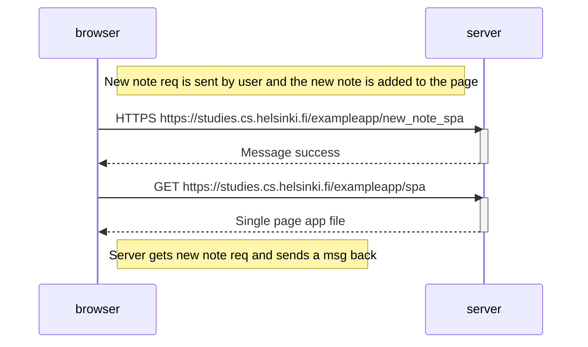

```mermaid
sequenceDiagram
    participant browser
    participant server
    
    Note right of browser: New note req is sent by user and the new note is added to the page

    browser->>server: HTTPS https://studies.cs.helsinki.fi/exampleapp/new_note_spa 
    activate server
    server-->>browser: Message success
    deactivate server
    
    browser->>server: GET https://studies.cs.helsinki.fi/exampleapp/spa
    activate server
    server-->>browser: Single page app file
    deactivate server
    
    Note right of browser: Server gets new note req and sends a msg back
   
```